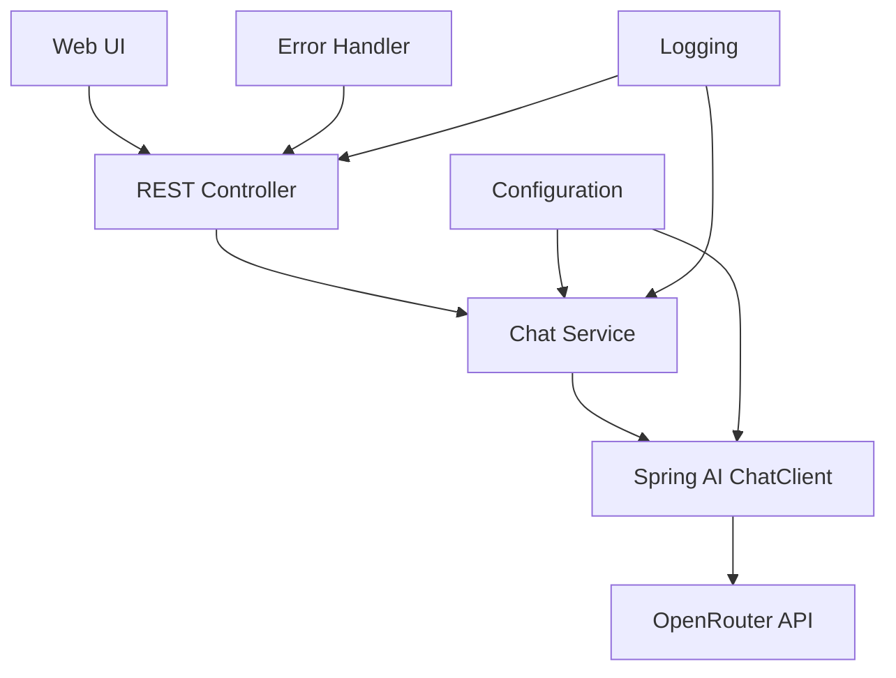

# 设计文档

## 概述

本设计文档描述了如何在现有的spring-ai-study项目中集成Spring AI框架和OpenRouter服务。该设计将提供一个完整的解决方案，包括依赖管理、配置、服务层、控制器层和前端界面，以实现与各种AI模型的交互。

## 架构

### 整体架构



### 技术栈

- **Spring Boot**: 2.6.6 (现有版本)
- **Spring AI**: 最新稳定版本
- **OpenRouter**: 作为AI模型提供商
- **Maven**: 依赖管理
- **Thymeleaf**: 前端模板引擎
- **SLF4J + Logback**: 日志记录
- **JUnit 5**: 单元测试

## 组件和接口

### 1. 依赖配置 (pom.xml)

需要添加以下关键依赖：
- Spring AI BOM (Bill of Materials)
- Spring AI OpenAI Starter (用于兼容OpenRouter)
- Spring Boot Starter Thymeleaf
- Spring Boot Starter Test

### 2. 配置类

#### ApplicationConfig
- 配置Spring AI ChatClient Bean
- 设置OpenRouter API连接参数
- 配置重试和超时策略

#### OpenRouterProperties
- 封装OpenRouter相关配置属性
- API密钥、基础URL、默认模型等

### 3. 服务层

#### ChatService
```java
public interface ChatService {
    ChatResponse sendMessage(String message);
    ChatResponse sendMessage(String message, String model);
    List<String> getAvailableModels();
}
```

#### ChatServiceImpl
- 实现ChatService接口
- 使用Spring AI ChatClient与OpenRouter交互
- 处理不同模型的调用
- 实现错误处理和重试逻辑

### 4. 控制器层

#### ChatController
- REST API端点：`/api/chat`
- 接受POST请求，处理聊天消息
- 返回JSON格式的响应
- 实现请求验证和错误处理

#### WebController
- 提供Web界面路由
- 渲染Thymeleaf模板
- 处理静态资源

### 5. 数据传输对象 (DTOs)

#### ChatRequest
```java
public class ChatRequest {
    private String message;
    private String model; // 可选
    // getters and setters
}
```

#### ChatResponse
```java
public class ChatResponse {
    private String response;
    private String model;
    private long timestamp;
    private boolean success;
    private String error; // 错误时使用
    // getters and setters
}
```

### 6. 前端界面

#### 聊天界面 (chat.html)
- 简单的聊天UI
- 消息输入框
- 消息历史显示
- 模型选择下拉框
- 加载状态指示器

#### 静态资源
- CSS样式文件
- JavaScript交互逻辑
- 响应式设计支持

## 数据模型

### 配置属性模型

```yaml
spring:
  ai:
    openai:
      api-key: ${OPENROUTER_API_KEY}
      base-url: https://openrouter.ai/api/v1
      chat:
        options:
          model: openai/gpt-3.5-turbo
          temperature: 0.7
          max-tokens: 1000

app:
  openrouter:
    default-model: openai/gpt-3.5-turbo
    available-models:
      - openai/gpt-3.5-turbo
      - openai/gpt-4
      - anthropic/claude-3-haiku
      - meta-llama/llama-2-70b-chat
```

### 请求/响应模型

- 所有API交互使用JSON格式
- 统一的错误响应格式
- 支持流式响应（可选扩展）

## 错误处理

### 异常层次结构

```java
public class ChatException extends RuntimeException {
    // 基础聊天异常
}

public class ApiConnectionException extends ChatException {
    // API连接异常
}

public class InvalidRequestException extends ChatException {
    // 无效请求异常
}

public class ModelNotAvailableException extends ChatException {
    // 模型不可用异常
}
```

### 全局异常处理器

```java
@ControllerAdvice
public class GlobalExceptionHandler {
    @ExceptionHandler(ChatException.class)
    public ResponseEntity<ErrorResponse> handleChatException(ChatException e);
    
    @ExceptionHandler(Exception.class)
    public ResponseEntity<ErrorResponse> handleGenericException(Exception e);
}
```

### 错误响应格式

```json
{
    "success": false,
    "error": "错误描述",
    "errorCode": "ERROR_CODE",
    "timestamp": "2024-01-01T12:00:00Z"
}
```

## 测试策略

### 单元测试

1. **服务层测试**
   - ChatService的各种场景测试
   - Mock OpenRouter API响应
   - 异常处理测试

2. **控制器测试**
   - REST API端点测试
   - 请求验证测试
   - 响应格式测试

3. **配置测试**
   - 配置属性加载测试
   - Bean创建测试

### 集成测试

1. **API集成测试**
   - 实际调用OpenRouter API
   - 端到端流程测试
   - 错误场景测试

2. **Web界面测试**
   - 页面渲染测试
   - JavaScript功能测试

### 测试配置

- 使用TestContainers进行集成测试
- Mock外部API调用进行单元测试
- 测试配置文件分离

## 安全考虑

### API密钥管理
- 使用环境变量存储敏感信息
- 不在代码中硬编码API密钥
- 配置文件中使用占位符

### 输入验证
- 验证用户输入长度和格式
- 防止注入攻击
- 限制请求频率

### 错误信息
- 不暴露敏感的系统信息
- 提供用户友好的错误消息
- 记录详细错误日志用于调试

## 性能优化

### 缓存策略
- 缓存模型列表
- 缓存常见查询结果
- 使用Spring Cache抽象

### 连接池
- 配置HTTP连接池
- 设置合适的超时时间
- 实现连接重用

### 异步处理
- 支持异步聊天请求
- 实现WebSocket支持（可选）
- 使用CompletableFuture处理长时间运行的任务

## 监控和日志

### 日志策略
- 结构化日志记录
- 不同级别的日志输出
- 敏感信息脱敏

### 监控指标
- API调用成功率
- 响应时间统计
- 错误率监控
- 资源使用情况

### 健康检查
- Spring Boot Actuator集成
- 自定义健康检查端点
- OpenRouter API连接状态检查